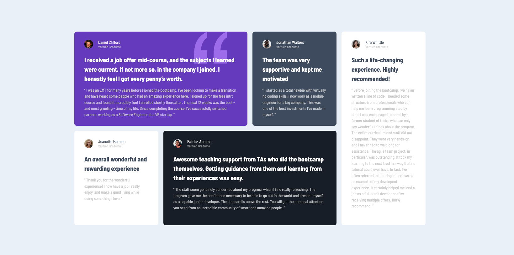

# Frontend Mentor - Testimonials grid section solution

This is a solution to the [Testimonials grid section challenge on Frontend Mentor](https://www.frontendmentor.io/challenges/testimonials-grid-section-Nnw6J7Un7). Frontend Mentor challenges help you improve your coding skills by building realistic projects.

## Table of contents

- [Overview](#overview)
  - [The challenge](#the-challenge)
  - [Screenshot](#screenshot)
  - [Links](#links)
- [My process](#my-process)
  - [Built with](#built-with)
  - [What I learned](#what-i-learned)
  - [Continued development](#continued-development)
  - [Useful resources](#useful-resources)
- [Author](#author)
- [Acknowledgments](#acknowledgments)

**Note: Delete this note and update the table of contents based on what sections you keep.**

## Overview

### The challenge

Users should be able to:

- View the optimal layout for the site depending on their device's screen size

### Screenshot

### Links

- Solution URL: [https://github.com/wideirp/testimonials-grid-section](https://github.com/wideirp/testimonials-grid-section)
- Live Site URL: [https://wideirp.github.io/testimonials-grid-section/](https://wideirp.github.io/testimonials-grid-section/)

## My process

### Built with

- Semantic HTML5 markup
- CSS custom properties
- Flexbox
- CSS Grid
- Sass
- CUBE CSS

### Continued development

The css needs to be refactored to conform to the CUBE CSS methodology.

### Useful resources

- [Kevin Powell | CUBE CSS in action](https://youtu.be/NanhQvnvbR8?si=ZEHOEt85NVZenTta)

## Author

- Website - [wideirp](https://wideirp.github.io)
- Frontend Mentor - [@wideirp](https://www.frontendmentor.io/profile/wideirp)
- Twitter - [@w1d31rp](https://www.twitter.com/w1d31rp)
